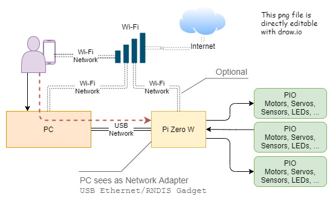

Windows Powershell scripts and automation for building and configuring Raspberry Pi (Zero W) as an Ethernet Gadget.  This means you can write a new Raspberry Pi Image and configure it for as a USB Network device and configure Wi-Fi before installing the card into a Raspberry Pi and starting it.

This _Powershell_ script configures a freshly created Raspberry Pi bootable SD card to appear as a private network when plugged into a computer over USB. This means you can configure the USB network and Wi-Fi for a brand new Raspberry Pi without logging into the box to do it. You get full network connectivity and tooling for working with a Raspberry Pi that would not otherwise be on a network.

I build this using PowerShell because my base laptop is a windows machine.



## Video Walkthrough

[](https://youtu.be/Ci_mZJoS3tg "Youtube")

# Configure a Raspberry PI O/S SDCard using Enable-Ethernet-Gadget.ps
1. Configures the Pi's USB as OTG
1. Makes the Pi appear a USB based network adapter with the Pi as the other device on the network. This is sometimes referred to as a _Network Gadget_ mode.
1. Enables SSH so you can ssh in over the USB connection or over wifi
1. _Optionally_ configures the wi-fi for a specific network
1. Copies some useful configuration scripts to the boot partition

## Usage
`Enable-Ethernet-Gadget -PIBootDrive F: -NetworkName my-ssid -NetworkPassword my-network-password`
* `PIBootDrive` The Drive letter for the SD card boot partition _Defaults to F:_
* `NetworkName` The SSID of your wireless network
* `NetworkPassword` The wireless network password

`NetworkName` and `NetworkPassword` are _optional_ parameters. Both are _required_ if either are specified.

# Configuring the Pi as a USB ethernet device
## Steps
1. Create a new micro SD card using the _Raspberry Pi Imager_
    1. You may have to eject the card and re-insert it to mount the boot partition
1. Run the script `Enable-Ethernet-Gadget.ps` as described in _Usage_
1. Eject the card and insert into Raspberry Pi Zero
1. Plug the _USB_ port into your computer.
1. Plug a power adapter into the _POWER_ port on the Raspberry Pi Zero
1. Wait for the device to boot up. The first boot is the slowest as it unpacks the fresh O/S
1. You should see `USB Ethernet/RNDIS Gadget` in the _Device Manager_ control panel
  * 
  
## Verify over the USB connection
1. `ping raspberrypi.local`
  ```
  PS C:\pi-zero-ethernet-gadget> ping raspberrypi.local
  Pinging raspberrypi.local [fe80::d31c:3ca4:a4b6:895f%61] with 32 bytes of data:
  Reply from fe80::d31c:3ca4:a4b6:895f%61: time=1ms
  Reply from fe80::d31c:3ca4:a4b6:895f%61: time<1ms
  Reply from fe80::d31c:3ca4:a4b6:895f%61: time<1ms
  Reply from fe80::d31c:3ca4:a4b6:895f%61: time<1ms
  ```
1. SSH to the device it is known as `raspberrypi.local` The default username is `pi` and the default password is `raspberry'
  * Using the linux WSL command prompt `ssh pi@raspberrypi.local`
  * Using Putty... _to be added_

## Log in and verify wifi (optional)
1. SSH into the device
1. run `ifconfig wlan0` and verify the IP address is from your network. 
  * A `169.x.y.z` address means it did not work.

# Troubleshooting
## Enabling Powershell scripts

You may have enable powershell scripts from an _elevated_ prompt
 `set-executionpolicy remotesigned`

## Enabling Debug Output

* Enable debug out put with
 *  `$DebugPreference = "Continue"`
* Disable debug with
 * `$DebugPreference = "SilentlyContinue"`
* Supposedly you can temporarily enable deebug outwith but I never got it to work: -Debug

# Related Sites
* Install Raspberry Pi OS using [Raspberry Pi Imager](https://www.raspberrypi.org/software/)
* [This site](https://medium.com/@aallan/setting-up-a-headless-raspberry-pi-zero-3ded0b83f274) provided the basis for this script

# Known Issues
1. Hard coded country code is 'US'

# All Gadget Modules
As of 11/2020

| | |
|-|-|
| Serial |  g_serial |
| Ethernet |  g_ether |
| Mass storage |  g_mass_storage |
| MIDI |  g_midi |
| Audio |  g_audio |
| Keyboard/Mouse |  g_hid |
| Mass storage and Serial |  g_acm_ms |
| Ethernet and Serial |  g_cdc |
| Multi |  g_multi - Allows you to configure 2 from Ethernet, Mass storage and Serial |
| Webcam |  g_webcam |
| Printer |  g_printer |
| Gadget tester |  g_zero |

# Additional scripts copied to boot partition
A set of **optional** utility scripts will be copied to the boot partition.

All of these must be run with _sudo_ 
| | script | purpose |
| - | - | - |
| | aircrack-install.sh | Converts this pi to an aircrack machine with monitor mode |
| Recommended | firewall.sh | Enables the firewall blocking all inbound traffic on wlan0 while leaving usb0 open |
| Recommended | hostname-custom-serial.sh | Sets the hostname of the pi to pi-<serial_id>.  Updates /etc/hostname and /etc/hosts |


