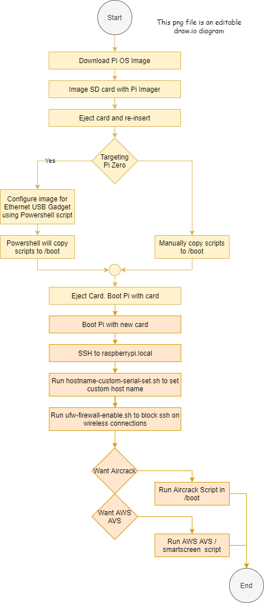

This project originally started as tooling to configure a Raspberry Pi Zero as an ethernet gadget to simplify Pi Zero software development.
It now contains a couple realitively unrelated sets of tools

| Segment | Target Machine |
| -- | -- |
| [Raspberry Pi Zero Ethernet Gadget - use networking over USB](./README.EtherGadget.md) | Raspberry Pi Zero |
| [AWS AVS SDK and Sample - Voice recognition using AVS - also Google](./README.AVS.md) | Raspberry Pi 3 and up, Pi Zero |
| [Utilities including custom host names](./README-Utility-Scripts.md) | Machines with Networking |
| [Utilities including wireless firewall restrictions](./README-Utility-Scripts.md) | Machines with wireless |
| [Hacking Aircrack installation](./README-Utility-Scripts.md) | Machines with wireless |

